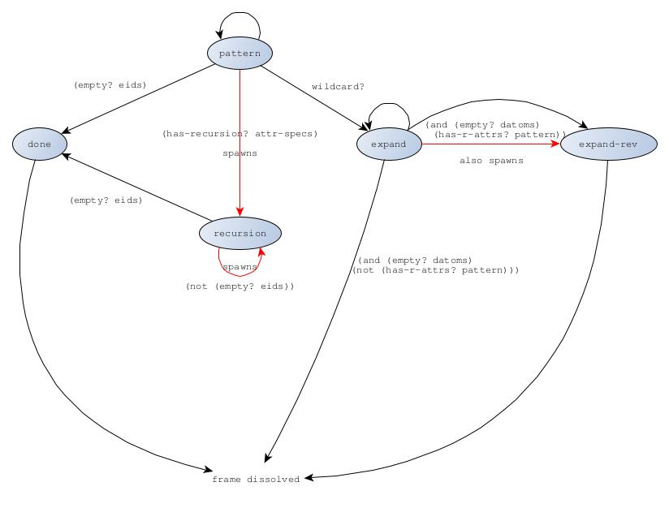

# Pull-API Namespace 

This document is aimed at Datahike core developers that want to debug or extend the Pull-API.
Hopefully, this will help people getting a grip of the existing code and work flow of the Pull-API.

## Terminology 

### Selector

A quoted vector holding one or several of the following expressions:
1) wildcard
   - pulls all datoms for entity id
   - e.g. `*` -> `{:db/id 1 :name "Petr" :child [{:db/id 2}]}`
2) keyword for
   - attributes to get
     - e.g. `:child` (= has child) -> `{:child [#:db{:id 10}]}`
   - reverse attributes to get (datom where requested entity is referenced)
     - signaled by underscore
     - e.g. `:_child` (= child of) -> `{:_child [#:db{:id 1}]}`
3) map of keywords for (reverse) attributes to get and
   - vectors of attributes
     - attribute should be reference
     - e.g. `{:child [:name :age]}` -> `{:child {:name "Thomas" :age 10}}`
     - e.g. `{:_child [:name :age]}` -> `{:_child {:name "Charles" :age 10}}`
   - three dots
     - for the infinite recursion on an attribute
   - number
     - for the finite recursion on an attribute
4) function call form:
   - limit:
     - restricts the amount of pulled datoms to the given number
     - e.g. `(limit :child 2)`
   - defaults:
     - sets a default value if search returns nil
     - e.g. `(default :name "unknown")`
5) vectors of 3
   - functions of 4) in vector form
     - attribute, function name as keyword, parameter
     - e.g. `[:child :limit 2]` or `[:name :default "unknown"]`
   - renaming of attributes with :as
     - attribute, :as, new name
     - e.g. `[:aka :as :alias]` or `[:name :as "Name"]`

### Pattern = (Pull-)Spec

Record with keys
- `:wildcard?` = boolean value indicating if wildcard expansion has to be done
- `:attrs` = map of attribute names as in selector and map with keys
  - `:attr` = attribute name as in database; only different from key when key describes reverse attribute
  - `:subpattern` (optional) = spec of a subpattern applied to an attribute
  - `:recursion` = always nil, only checks if key exists, if it does: recursion is applied on attribute
  - `:limit`= amount of maximum number of results returned
  - `:default` = default value if nothing found


### Frame

Map with keys
  - `:multi?` = true if multiple entities requested
  - `:eids` = vector of eids to pull pattern for
  - `:state` = pattern/expand/expand-rev/recursion/done
  - `:pattern` = (Pull-)Spec
  - `:recursion` = map with keys :depth (depth per attribute) and :seen (eids)
  - `:specs` = attrs from spec
  - `:wildcard?` = wildcard from spec
  - `:kvps` = final result map; in pull-pattern transfered to next frame when current frame is done
  - `:results` = result map for current frame, i.e. for current attribute
  - `:attr` = optional; current attribute (pull-attr-datoms) or enum, e.g. recursion
  - `:datoms` = optional; datoms pulled from database; e.g. added by wildcard-expand
  - `:expand-kvps` = optional; added by expand-frame, used by expand-rev-frame

#### Frame Creation and State Changes

- only 1 frame created for basic input pattern
- additional frames added on processing of
  - recursion: 2 frames per depth
  - wildcard: 1 frame
  


## Pull API Usage

See also the official [Datahike documentation](https://cljdoc.org/d/io.replikativ/datahike/0.3.2/api/datahike.api#pull).

Setup for examples:

```clojure
(require '[datahike.db :as db]
         '[datahike.api :as d])

(def schema
  {:aka    {:db/cardinality :db.cardinality/many}
   :child  {:db/cardinality :db.cardinality/many
            :db/valueType :db.type/ref}
   :friend {:db/cardinality :db.cardinality/many
            :db/valueType :db.type/ref}
   :father {:db/valueType :db.type/ref}
   :spec   {:db/valueType :db.type/ref
            :db/isComponent true
            :db/cardinality :db.cardinality/one}})

(def datoms
  (->>
   [[1 :name  "Petr"]
    [1 :aka   "Devil"]
    [1 :aka   "Tupen"]
    [1 :aka   "P"]
    [2 :name  "David"]
    [3 :name  "Thomas"]
    [4 :name  "Lucy"]
    [5 :name  "Elizabeth"]
    [6 :name  "Matthew"]
    [7 :name  "Eunan"]
    [8 :name  "Kerri"]
    [9 :name  "Rebecca"]
    [1 :child 2]
    [1 :child 3]
    [2 :father 1]
    [3 :father 1]
    [6 :father 3]
    [4 :friend 5]
    [5 :friend 6]]
   (map (fn [[e a v]] (d/datom e a v tx0)))))

(def example-db (d/init-db datoms schema))
```

### Examples


Simple Pull
```clojure
(d/pull example-db '[:name] 1)

;; => {:name "Petr"}
```

Pull reverse attribute
```clojure
(d/pull example-db '[:_child] 2)

;; => {:_child [#:db{:id 1}]}
```

Pull db/id

```clojure
(d/pull example-db '[:name :db/id] 6)

;; => {:name "Matthew", :db/id 6}
```

Pull wildcard
```clojure
(d/pull example-db '[*] 2)

;; => {:db/id 2, :father #:db{:id 1}, :name "David"}
```

Pull recursion
```clojure
(d/pull example-db '[:db/id :name {:friend ...}] 4)

;; => {:db/id 4, :name "Lucy", :friend [{:db/id 5, :name "Elizabeth", :friend [{:db/id 6, :name "Matthew"}]}]}
```

Pull with default 
```clojure
(d/pull example-db '[(default :foo "bar")] 1)

;; => {:foo "bar"}
```

Pull with limit
```clojure
(d/pull example-db '[(limit :aka 2)] 1)

;; => {:aka ["Devil" "Tupen"]}
```

Pull with subpattern
```clojure
(d/pull example-db '[{:father [:name]}] 6) 

;; => {:father {:name "Thomas"}}
```

